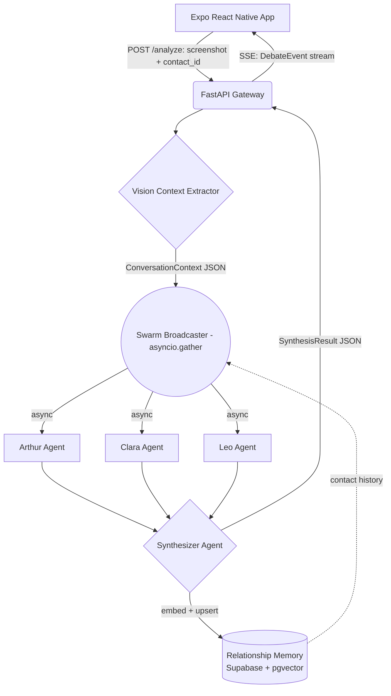

# System Architecture — RESET AI

## 1. Pipeline overview

Every analysis run is a single HTTP request (`POST /analyze`) that stays open as a Server-Sent Events stream while a 4-stage, mostly-parallel pipeline executes:

1. **Context Extraction (Vision)** — a multimodal LLM call parses the uploaded screenshot into structured messages: text, sender (`user` vs `match`), bubble color, timestamp, and response lag.
2. **Parallel Swarm Debate** — the extracted context (plus any Relationship Memory for this contact) is broadcast concurrently to three persona agents. They run via `asyncio.gather`, not sequential turns — nothing about this step is a "conversation" between the agents, it's fan-out/fan-in.
   - **Arthur** — High-Value Frame Expert.
   - **Clara** — Psychology Specialist.
   - **Leo** — Flirty Confident Boy.
3. **Synthesizer Node** — a single "judge" LLM call reads all three opinions, resolves contradictions, and returns the final answer as strict JSON (schema in §3). Arthur dictates boundaries, Clara dictates empathy, Leo dictates final vocabulary.
4. **Memory Write** — the synthesized result is embedded and upserted into `memory_embeddings` for the contact, so the next screenshot of the same person carries history into stage 2.

No stage is a heavyweight orchestration graph (no LangChain/LangGraph). The whole pipeline is a plain Python async generator (`SwarmOrchestrator.run_pipeline`) yielding typed `DebateEvent`s as each stage completes, which is what makes the SSE stream possible without extra infrastructure.

## 2. Diagram



## 3. Final output schema

The Synthesizer must return exactly this shape (see `backend/models/schemas.py::SynthesisResult`, which is the single source of truth this doc mirrors):

```json
{
  "attraction_level": 7,
  "dynamic_analysis": "They are throwing a compliance test. Do not validate immediately.",
  "what_they_are_thinking": ["Testing their frame", "Wants to see if the user is needy"],
  "best_response": "The calibrated flirty response...",
  "alternative_responses": {
    "playful": "...",
    "direct": "..."
  },
  "coaching_lesson": "Never trade masculine tension for a safe friend-zone pass."
}
```

## 4. Streaming transport: SSE, not WebSocket

`POST /analyze` returns a `StreamingResponse` (`text/event-stream`) carrying a sequence of `DebateEvent`s (`extraction_started` → `extraction_done` → 3×`agent_started`/`agent_done` → `synthesis_started` → `synthesis_done`), ending with the full `SynthesisResult` in the last event's payload.

This is SSE rather than a WebSocket because the traffic is one-directional (server → client) with no need for the client to steer an in-flight debate. SSE needs no upgrade handshake, rides ordinary HTTPS through mobile carrier NAT/proxies without special handling, and is a one-line `StreamingResponse` in FastAPI — no extra library. A single blocking JSON response would collapse the "slot machine" debate reveal (see `ux_hook_blueprint.md`) into a plain spinner, which defeats the core variable-reward hook the product depends on.

## 5. Data model (Supabase / Postgres + pgvector)

```sql
create extension if not exists vector;

create table users (
  id uuid primary key default gen_random_uuid(),
  email text unique,
  created_at timestamptz not null default now()
);

create table contacts (
  id uuid primary key default gen_random_uuid(),
  user_id uuid not null references users(id) on delete cascade,
  display_name text not null,
  created_at timestamptz not null default now(),
  last_interaction_at timestamptz
);
create index idx_contacts_user_id on contacts(user_id);

create table sessions (
  id uuid primary key default gen_random_uuid(),
  user_id uuid not null references users(id) on delete cascade,
  contact_id uuid references contacts(id) on delete set null,
  image_storage_path text,           -- nullable, unused by default; see privacy note below
  status text not null default 'pending',
  created_at timestamptz not null default now()
);
create index idx_sessions_user_contact on sessions(user_id, contact_id);

create table messages (
  id uuid primary key default gen_random_uuid(),
  session_id uuid not null references sessions(id) on delete cascade,
  sender text not null check (sender in ('user','match')),
  text text not null,
  ts timestamptz,
  bubble_color text,
  response_lag_seconds numeric,
  order_index int not null
);
create index idx_messages_session_id on messages(session_id);

create table analysis_results (
  id uuid primary key default gen_random_uuid(),
  session_id uuid not null references sessions(id) on delete cascade,
  attraction_level int not null check (attraction_level between 1 and 10),
  dynamic_analysis text not null,
  what_she_is_thinking jsonb not null,
  best_response text not null,
  alternative_responses jsonb not null,
  coaching_lesson text not null,
  created_at timestamptz not null default now()
);
create index idx_analysis_results_session_id on analysis_results(session_id);

create table memory_embeddings (
  id uuid primary key default gen_random_uuid(),
  contact_id uuid not null references contacts(id) on delete cascade,
  session_id uuid references sessions(id) on delete set null,
  summary text not null,
  embedding vector(512),             -- voyage-3-lite dimension; see backend/.env.example
  created_at timestamptz not null default now()
);
create index idx_memory_embeddings_contact_id on memory_embeddings(contact_id);
create index idx_memory_embeddings_vector on memory_embeddings
  using hnsw (embedding vector_cosine_ops);
```

**Privacy note:** raw screenshots are processed in-memory during extraction and discarded — `sessions.image_storage_path` stays null unless a future "view original" feature is explicitly opted into. Only the extracted text and analysis are persisted.

## 6. Provider seams

`backend/llm_clients/base.py` defines a single `LLMClient` protocol (`vision_extract`, `complete_json`, `complete_text`). Two clients are wired at runtime:

- **Vision + Synthesis client** — Anthropic (`claude-sonnet-5` by default, overridable via `ANTHROPIC_VISION_MODEL`). Uses `vision_extract` and `complete_json` (structured JSON output, not prefill).
- **Debate client** — fast/cheap provider (Groq Llama-3.3-70b by default, Gemini 2.0 Flash as an alternate) for Arthur/Clara/Leo. Uses only `complete_text`.

Swapping either provider means implementing `LLMClient` in a new file under `llm_clients/` — no changes to `swarm_orchestrator.py` or `main.py`.
